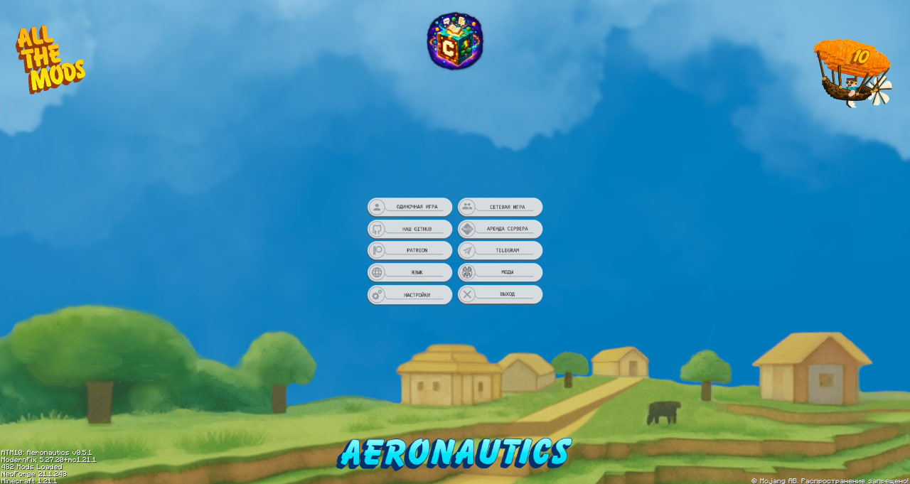
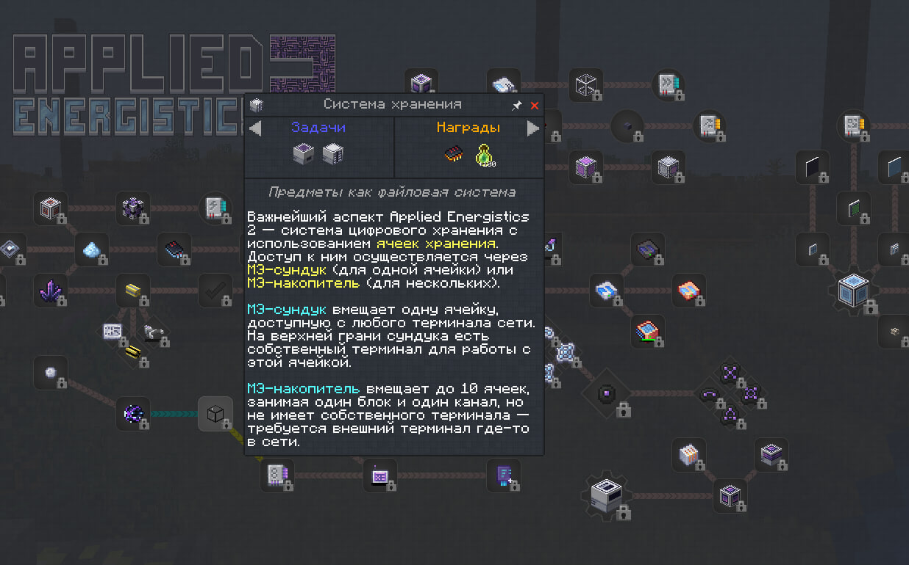
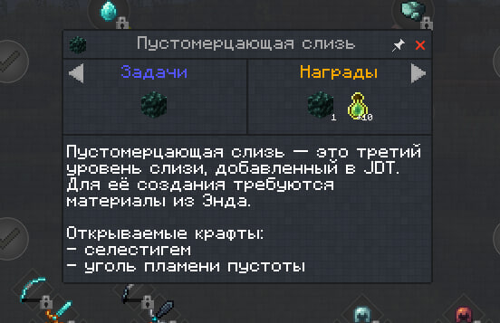
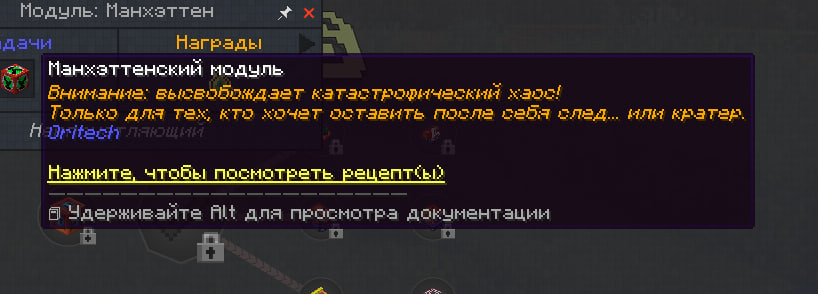
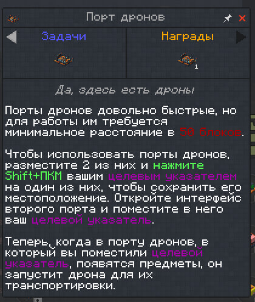
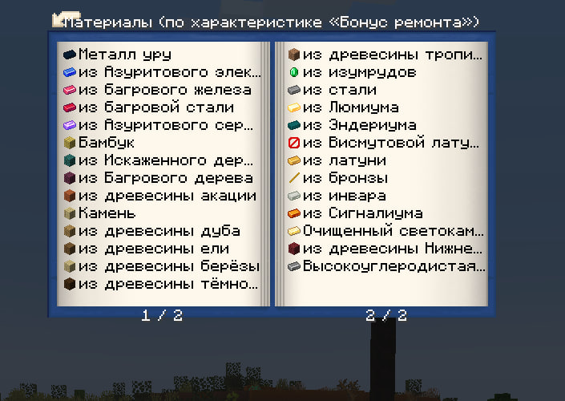

# Кубик Смысла — All the Mods 10: Aeronautics RU

[⬇️ **Скачать русский перевод v1.0.0 одним ZIP-файлом**](https://github.com/kubik-smysla/all-the-mods-10-aeronautics-ru/releases/download/v1.0.0/Kubik_Smysla_All_the_Mods_10_Aeronautics_RU_0.5.1_v1.0.0.zip)

Неофициальная русская локализация сборки **All the Mods 10: Aeronautics 0.5.1**. Текст переведён и вычитан по смыслу: формулировки звучат естественно, а названия предметов и механик согласованы между квестами, интерфейсами и внутриигровыми руководствами.

## Совместимость

| Компонент | Версия |
|---|---|
| Minecraft | 1.21.1 |
| NeoForge | 21.1.248 |
| All the Mods 10: Aeronautics | 0.5.1 |
| Русский перевод | 1.0.0 |

## Что переведено

- все 64 главы квестовой книги и 8 213 строк активных заданий;
- интерфейсы, предметы, подсказки и настройки поддерживаемых модов;
- доступные внутриигровые руководства, включая книги Occultism, NeoVitae, Productive Bees, PneumaticCraft и других модов;
- главное меню и кнопки навигации;
- технологическая, магическая и исследовательская терминология.

## Скриншоты

| Главное меню | Квестовая книга |
|---|---|
|  |  |
|  |  |
|  |  |

## Установка

1. Установите оригинальную [All the Mods 10: Aeronautics](https://www.curseforge.com/minecraft/modpacks/all-the-mods-10-aeronautics) версии **0.5.1** через CurseForge.
2. Полностью закройте Minecraft.
3. [Скачайте ZIP с переводом](https://github.com/kubik-smysla/all-the-mods-10-aeronautics-ru/releases/download/v1.0.0/Kubik_Smysla_All_the_Mods_10_Aeronautics_RU_0.5.1_v1.0.0.zip).
4. Откройте корневую папку профиля сборки.
5. Перенесите из архива папки `config` и `kubejs` в корень профиля, согласившись на объединение и замену файлов.
6. Запустите игру и выберите русский язык.

Архив не содержит модов или самой сборки — только локализацию и необходимые для неё файлы.

## Обратная связь

Нашли английскую строку, ошибку или непонятную формулировку? Пришлите скриншот и укажите, где она встретилась:

- [Telegram — Кубик Смысла](https://t.me/kubik_smysla)
- [VK — Кубик Смысла](https://vk.ru/kubik_smysla)
- [GitHub — Кубик Смысла](https://github.com/kubik-smysla)

Оригинальная сборка создана **ATMTeam**. Все права на Minecraft, моды и исходные материалы принадлежат их правообладателям. Сведения об использованных сторонних переводах приведены в [THIRD_PARTY_NOTICES.md](THIRD_PARTY_NOTICES.md).

**Кубик Смысла — переводим Minecraft со смыслом.**
